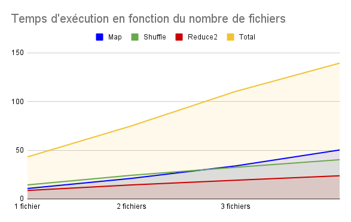

# TP MapReduce

Plan :
- **Etape 1** : le tri, l'initialisation de la hashmap, les résultats
- **Etape 10-11-12-13** : les choix d'implementation, le temps d'exécution en fonction du nombre de fichiers, les mesures
- **Preuve de la loi d'Amdahl**


## Etape 1

### Le tri

Il y a différentes sortes de SortedMap : notamment TreeMap qui trie en fonction des clés. 

J'ai utilisé une HashMap et le tri par défaut de Java en précisant la comparaison utilisée.

### L'initialisation de la hashmap

Pour accélerer le programme, je cherche à donner la bonne taille à la hashmap lorsque je la créée.
En effet, ça permet d'éviter le ralentissement du au fait que la hashmap doit allouer de l'espace supplémentaire quand le nombre de paires clés-valeurs augmente.

J'estime la taille de la hashmap finale en fonction de la taille du fichier.

La taille de la hashmap est en **nombre de paires clés-valeurs**, la taille du fichier est en **octets**.

En utilisant le permier fichier CC et des splits du même fichier, je fais des calculs de régression pour déterminer approximativement la bonne valeur initiale de la hashmap (plus de détails : https://docs.google.com/spreadsheets/d/1sRl5x2Gj2o79t6C_cjSijqdmXbPOs-jOEo7ymaTNo2A/edit?usp=sharing). 

Comme ce calcul a été réalisé pour des fichiers avec plusieurs langues, ce n'est pas la régression la plus efficace pour les textes en français.


### Résultats

Pour exécuter le code :
```bash
cd etape1
ant
java -cp target src.Main ../textes/forestier_mayotte.txt
```

Voici les mots les plus fréquentes dans les différents fichiers :

                                      |---------------|---------------|---------------|---------------|
                                      |  1er mot      |  2ème mot     |  3ème mot     |  4ème mot     |
    |---------------------------------|---------------|---------------|---------------|---------------|
    |   forestier_mayotte             |  de  | 12     |  biens | 8    |  ou  | 8      | forestier | 6 |
    |---------------------------------|---------------|---------------|---------------|---------------|
    |   deontologie_police_nationale  |  de  | 86     |  la  | 40     |  police | 29  |  et  | 27     |
    |---------------------------------|---------------|---------------|---------------|---------------|
    |   domaine_public_fluvial        |  de  | 621    |  le  | 373    |  du  | 347    |  la  | 330    |
    |---------------------------------|---------------|---------------|---------------|---------------|
    |   sante_publique                |  de  | 189699 |  la  | 74433  |  des | 66705  |   à  | 65462  |
    |---------------------------------|---------------|---------------|---------------|---------------|
    |   premier fichier commoncrawl   |  the | 368564 |  to  | 287915 |  and | 280938 |  of  | 250764 |
    |---------------------------------|---------------|---------------|---------------|---------------|

Et voici les temps d'exécution sur l'ordinateur tp-3a107-03, il s'agit de la première exécution sur cette machine (pas de cache pour la lecture) :

                                      |-------------|-----------|-------------------------|
                                      |  comptage   |  tri      |  taille du fichier      |
    |---------------------------------|-------------|-----------|-------------------------|
    |   forestier_mayotte             |  7 ms       |  1ms      |  1381                   |
    |---------------------------------|-------------|-----------|-------------------------|
    |   deontologie_police_nationale  |  12ms       |  3ms      |  7488                   |
    |---------------------------------|-------------|-----------|-------------------------|
    |   domaine_public_fluvial        |  27ms       |  4ms      |  71173                  |
    |---------------------------------|-------------|-----------|-------------------------|
    |   sante_publique                |  836ms      |  57ms     |  18111630               |
    |---------------------------------|-------------|-----------|-------------------------|
    |   premier fichier commoncrawl   |  13904ms    |  4323ms   |  344847006              |
    |---------------------------------|-------------|-----------|-------------------------|

Les fichiers sont par ordre de taille croissant. On peut voir que le temps de calcul ne dépend pas seulement de la taille du fichier mais aussi probablement de la qualité de l'estimation de la taille de la hashmap.


## Etape 10-11-12-13

### Choix d'implémentation

Chaque slave ouvre un seul port pour recevoir les messages : j'aurais pu paralléliser la réception en ouvrant plusieurs ports.

Pour éviter qu'il y ait des problèmes de réception, le listener fait spawn des threads pour gérer les messages.

Pour le tri final lors du 2ème MapReduce, j'ai choisi de ne pas séparer les données en tranches triées, mais de hasher lors du shuffle pour équilibrer la quantitée de données envoyée à chaque slave. En conséquence, le master passe plus de temps à trier les données qu'il reçoit tout à la fin.

### Temps d'exécution en fonction du nombre de fichiers

J'ai mesuré le temps que met **un seul slave** à réaliser le traitement de 1, 2, 3 et 5 fichiers :

               |---------|----------|----------|----------|
               |  1 file |  2 files |  3 files |  5 files |
    |----------|---------|----------|----------|----------|
    |   TOTAL  |  43.1s  |   75.0s  |  105.9s  |  139.5s  |
    |----------|---------|----------|----------|----------|
    |   Map    |  10.7s  |   21.1s  |   33.9s  |   50.3s  |
    |----------|---------|----------|----------|----------|
    |  Shuffle |  14.4s  |   24.3s  |   32.5s  |   40.3s  |
    |----------|---------|----------|----------|----------|
    |  Reduce  |   0.6s  |    0.5s  |    0.7s  |    0.8s  |
    |----------|---------|----------|----------|----------|
    |   Map2   |   0.2s  |    0.4s  |    0.5s  |    0.7s  |
    |----------|---------|----------|----------|----------|
    | Shuffle2 |   8.5s  |   14.3s  |   19.1s  |   23.6s  |
    |----------|---------|----------|----------|----------|
    |  Reduce2 |   8.7s  |   14.4s  |   19.2s  |   23.8s  |
    |----------|---------|----------|----------|----------| 

On peut remarquer que les **temps de Map augmentent plus** que pour toutes les autres étapes.

Alors que le temps de Map lorsqu'il y a deux fois plus de données à lire, les autres étapes perçoivent une augmentation du temps moindre, et qui diminue avec le nombre de slaves. On peut s'y attendre comme la taille de la hashmap qui contient le compte de mot ne va pas doubler avec l'entrée puisque certaines clés seront déjà présentes dans la hashmap.





## Mesures

Globalement, **les temps d'exécutions varient énormément**, même en choisissant des machines peu utilisées.
En plus la mesure est compliquée **à cause du cache**, puisque lorqu'on utilise les mêmes machines (pour ne pas changer de puissance/nb d'utilisateurs), la première lecture du même fichier est plus lente que les suivantes.

J'ai testé mon programme sur un corpus de 12 fichiers (les fichiers CC 00100 à 00111). J'ai executé le map reduce avec 3, 4, 6 slaves qui traitent respectivement 4, 3, 2 fichiers. J'ai executé sans allouer d'espace mémoire supplémentaire.

Les résultats détaillés sont dans le tableau suivant. (Les temps d'exécution étaient très élevés sur les machines que j'ai utilisées).

               |----------|----------|----------|
               | 3 slaves | 4 slaves | 6 slaves |
    |----------|----------|----------|----------|
    |   TOTAL  |  509.8s  |  394.6s  |  320.7s  |    
    |----------|----------|----------|----------|
    |   Map    |  327.5s  |  246.3s  |  196.5s  |
    |----------|----------|----------|----------|
    |  Shuffle |   47.1s  |   29.3s  |   16.4s  |
    |----------|----------|----------|----------|
    |  Reduce  |    3.1s  |    2.6s  |    2.5s  |
    |----------|----------|----------|----------|
    |   Map2   |    1.5s  |    1.2s  |    0.9s  |
    |----------|----------|----------|----------|
    | Shuffle2 |   36.8s  |   28.2s  |   19.5s  |
    |----------|----------|----------|----------|
    |  Reduce2 |   93.8s  |   87.0s  |   84.9s  |
    |----------|----------|----------|----------|

Pour calculer la part de code parallélisable, j'ai utilisé la formule suivante : 

$$\frac{t_2}{t_1} = \frac{(1 - p) + \frac{p}{n_2}}{(1 - p) + \frac{p}{n_1}}$$

avec $t_1$ : la durée de l'exécution 1,

$t_2$ : la durée de l'exécution 2,

$n_1$ : le nombre de slaves pour l'exécution 1,

$n_2$ : le nombre de slaves pour l'exécution 2,

$p$ : la proportion de code parallélisable


on peut en déduire :

$$p = \frac{\frac{t_2}{t_1} - 1}{\frac{1}{n_2} - 1 - \frac{t_2}{t_1}*\left(\frac{1}{n_1} - 1 \right)}$$

J'ai donc pu calculer p en faisant la moyenne des trois valeurs obtenues en comparant les 3 exécutions (voici les calculs détaillés : https://docs.google.com/spreadsheets/d/1xtcNH8XVfMqlRcaSybBeIaSp4cphzzLlFbPPctTCzdo/edit?usp=sharing) et j'obtiens :


               |----------|
               |      p   |
    |----------|----------|
    |   TOTAL  |     90%  |
    |----------|----------|
    |   Map    |     93%  |
    |----------|----------|
    |  Shuffle |    109%  |
    |----------|----------|
    |  Reduce  |     61%  |
    |----------|----------|
    |   Map2   |     92%  |
    |----------|----------|
    | Shuffle2 |     98%  |
    |----------|----------|
    |  Reduce2 |     40%  |
    |----------|----------|

On remarque que les résultats ne sont **pas très précis** puisqu'on trouve $p > 100%$ pour le Shuffle ce qui est **impossible**.
C'est probablement dû au fait que la première exécution s'est fait plus lentement que la loi d'Amdahl le prévoyait.

De plus on remarque que les étapes de Reduce sont **les plus lentes**. Pour Reduce2, c'est parce que Master doit retrier les clés lui-même dans mon implémentation.
Pour Reduce, c'est plus difficile à expliquer.

## Preuve de la loi d'Amdahl

Pour prouver la loi d'Amdahl, j'ai écrit un script spécial pour pouvoir tracer le temps d'exécution en fonction du nombre de slave avec beaucoup de données en abscisse.